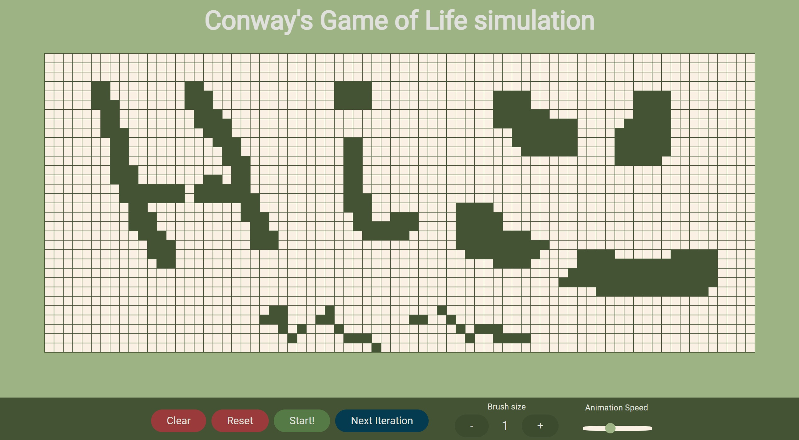

## Conway's Game of Life

This is my bare bones implementation of the famous cellular automation. In its current state, it uses JavaScript Canvas object to draw everything on screen, and in turn is quite slow, especially the larger your viewport is. Although I am sure it could be optimized, it wasn't my goal.

That being said, It is enough to mess around with but not to create anything meaningful, as it does not offer a save/load feature.

### Features
- Simulate the next iteration
- Start/Pause iterations with adjustable speed
- Reset the board to the initial position, before starting the animation, to make adjustments
- Clear the board completely
- Change the brush size
- Hold-and-drag for faster drawing (Hold **x** to delete)

---

---

